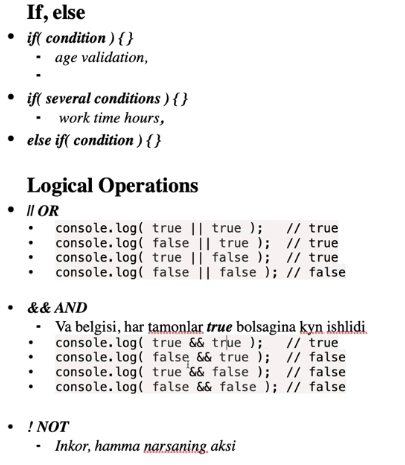
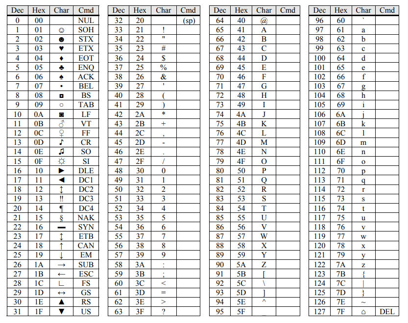

# JavaScript-2023-lessons

### JavaScript 2023 lessons and homeworks start

JavaScript dasturidan bilishingiz kerak bo'lgan barcha mavzular no'ldan boshlab tushuntirilgan. Darslik uch qisimga bo'lingan: beginner, advanced va expert darajasida. WebBrain Academy

<h2>2-dars | Type Convirsions | Operators | Comparision | Logical Operators</h2>

— Type conversions  
— Operators + - * / % () = ++ -- **  
— Comparision == === <> <= >=  
— Logical Operations || && !  

## Basic operators, maths
-Addition +  
-Subtraction -  
-Multiplication _  
-Division /  
-Remainder %  
-Exponentiation **  
-Braces ()  
-Equality =, ==, ===  
-Obrivations +=, -=, /=, _=  
-Increment ++  
-Decrament --  

